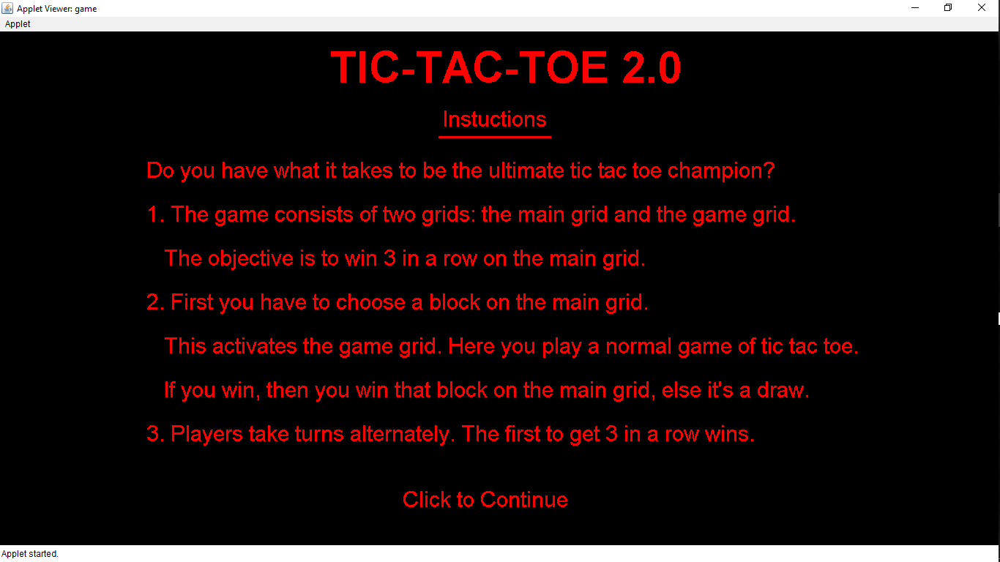
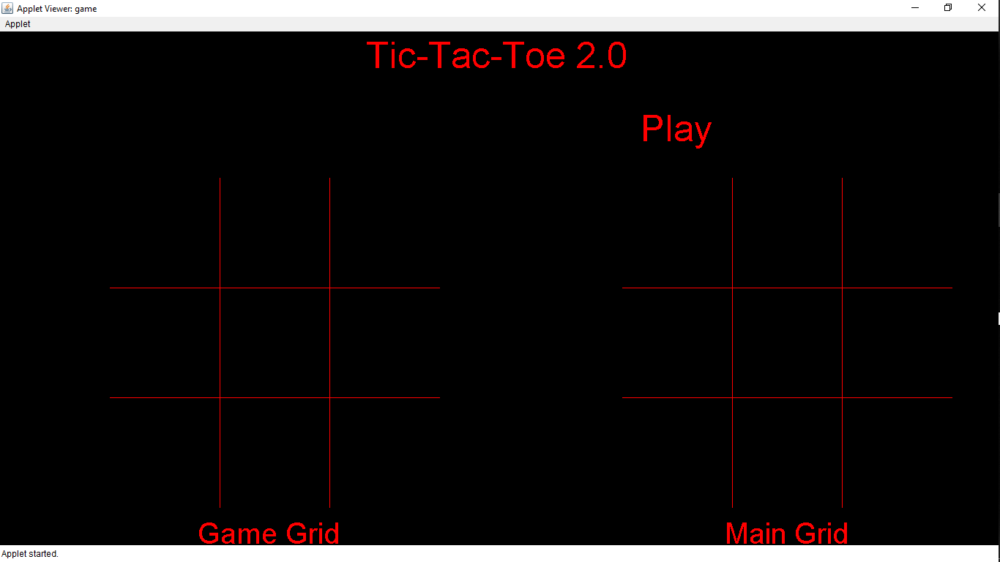
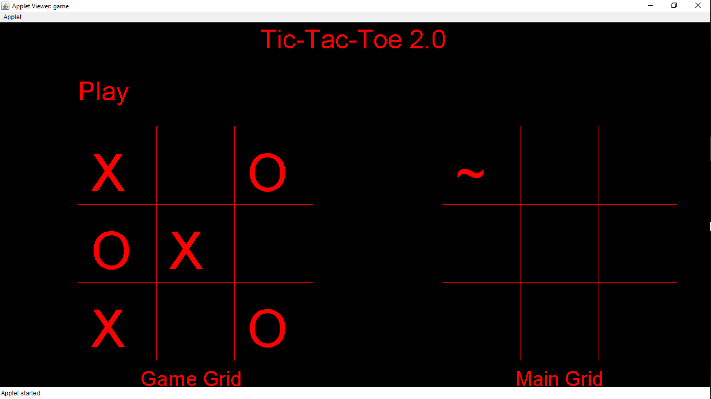
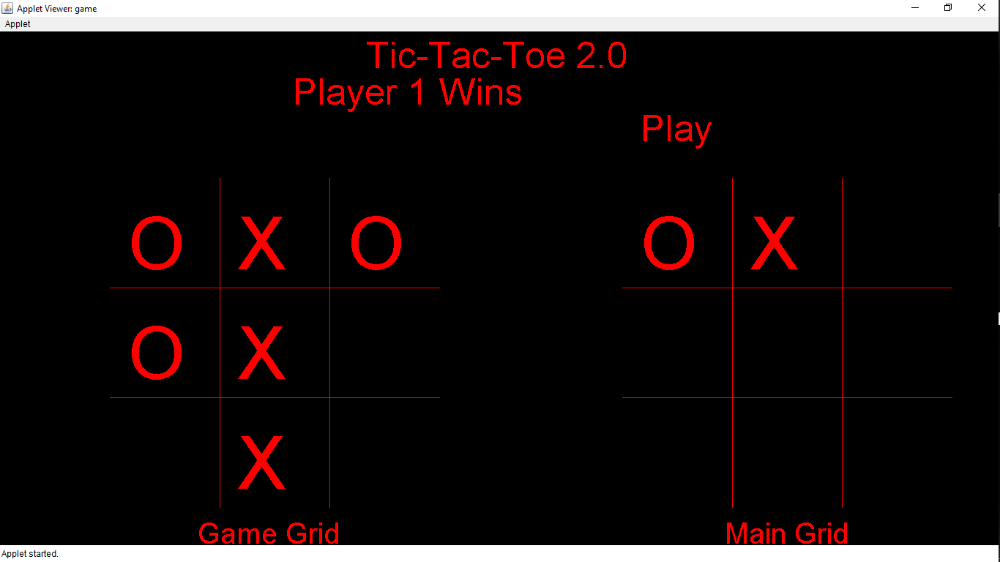
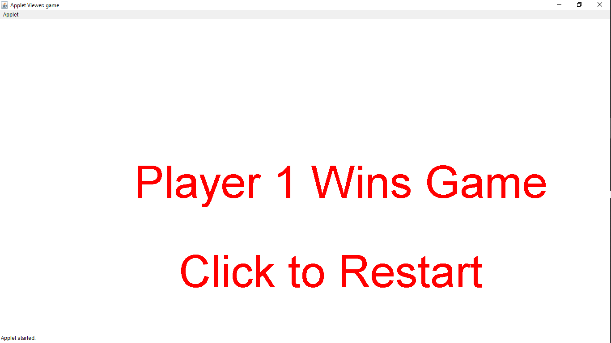

# Tic-Tac-Toe-2.0

The game is a modification over the classical game tic tac toe. The game consists of two grids (Main grid, Game grid).
The objective is win 3 consecutive blocks on the main grid. The game starts by selecting a block on the main grid which activates the game grid. In the game grid we play a normal game of tic tac toe. 

The winner of the game wins the block on the main grid, else it’s a draw. You continue till a player either wins on the main grid or it’s a draw .

The result is displayed once the game is finished. There is an option of playing it again.

Game Screen

Game in Progress

Player 2 wins 1st game in game grid

Player 1 wins 2nd game in game grid

Result Screen 

